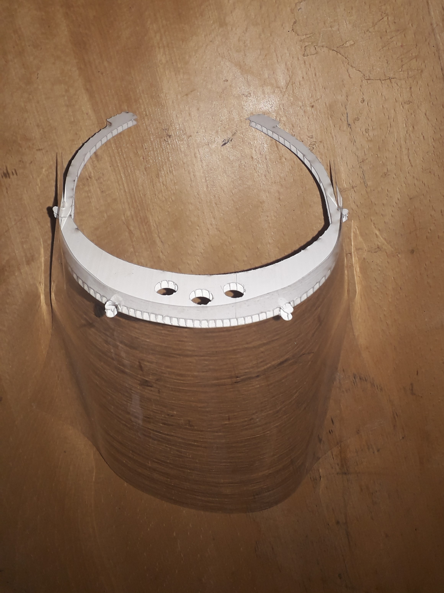

# 🥽 Laser Cutted FaceShield 
Laser Cut Face Shield For tunisian doctors and medical staff. 

<figure>
 <figcaption>FAB619 PP laser cutted by Hazem Ben Ammar </figcaption>
</figure>
  
<figure>
 <figcaption>Taha design laser cutted @ <a href="https://goo.gl/maps/heunsmjetvxHZNRN7">El FabSpace Lac</a> </figcaption>
</figure>

# 🚫 IMPORTANT !! Sterilizing for Medical Use
It is highly recommended to submerge (sink) the shield parts into disinfection solutions (ex Sodium hypochlorite, Isopropyl alcohol )
for more than 5 minutes, this way you will ensure that the solution reaches 100 % of the surface. You can also use aerosol (spray) but apply the procedure at least twice to reach most of the surface.

### [English](./README.md) |  [Français (A faire) ](./README_FR.md) | 

# 💪 How to Contribute
If you think that you can contribute to the effort, or that you, or your organization can benefit from our efforts, use the links below to contact us

## Voleenter to laser cut shields
#### 3mm Plexiglass (PMMA) 
* V1 published by [FAB619](https://github.com/FAB619) : [Link](https://github.com/FAB619/Protection-Mask-Laser-Cut-/tree/master/PMMA-V1)
* V2 published by [Grach Taha](http://grabcad.com/library/visiere-decoupe-laser-1) (ENISO student): [Link](https://github.com/FAB619/Protection-Mask-Laser-Cut-/tree/master/PMMA-V2)
#### 5mm Polypropylene (PP)
* DXF File : [Link](https://github.com/FAB619/Protection-Mask-Laser-Cut-/tree/master/PP-V1)

# License 
 The design is licensed under a <a rel="license" href="http://creativecommons.org/licenses/by-nc/4.0/">Licence Creative Commons Attribution - Pas d’Utilisation Commerciale 4.0 International</a>.

We share these files under non-commerical licence. It would be great if you donated these shields to those in need for free. If you need to cover your production costs, we are ok with you selling the shields for production cost.

# 🚧 A Note About Safety and Liability
This documentation will be continuously improved as soon there are updates for doctors needs.

There are engineering and manufacturing risks around medical devices. Though the FDA has issued Emergency Use Authorizations (EUA) (Coronavirus Disease 2019 (COVID-19) Emergency Use Authorizations for Medical Devices, FDA), to avoid doing more harm than good, it is recommended to attempt to the best of your ability and circumstances to follow regulations, which may seem cumbersome, but exist for good reason.

# ✅ Other Open Source Face Shield Designs
## Laser Cutted 
### Frameless designs
- Center for Design Research, University of Kansas : https://www.notion.so/Open-Source-Face-Shield-c7ebd84f2dbe4be5ab0974c85c49d9ff
- Protohaven Proto Shield: https://www.protohaven.org/proto-shield/
## 3D Printed
- NIH Design: https://3dprint.nih.gov/collections/covid-19-response
- Fab619 TN Maks: https://github.com/FAB619/Protection-Mask--COVID-19
- Prusa Reasearch RC3 Remixedby Timothy Prestero : https://www.prusaprinters.org/prints/27748-dtm-v30-face-shield-ppe-for-covid-19-remix-of-prus

# ❓ FAQ [ To Do ]
Are polypropylène (PP) and Plexiglas PMMA laser cutted parts sterile? 
